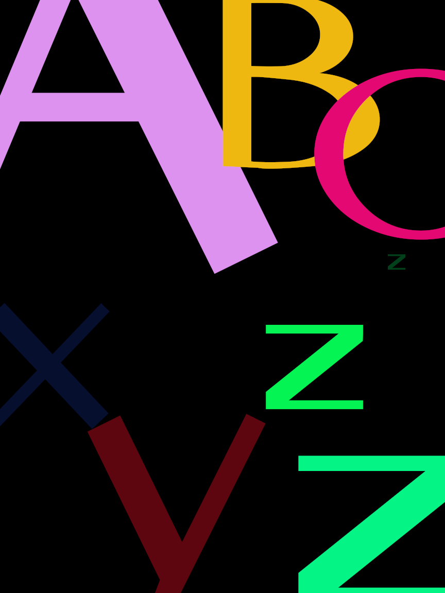

Pulido
======

Is a sans-serif font inspired by the hinting glitches of DejaVu Sans on FreeType at low resolutions.

##Dedication
Dedicated to S.M.G.C. and released today with the motive of [Joaquín Ibarra](https://es.wikipedia.org/wiki/Joaqu%C3%ADn_Ibarra) 300 ANIVERSARY (1725-1785)

#About the fontname
Hinting (en)  >>  tipara polurado (eo)  >>  Pulido de fuentes (es) >> Pulido	 \
																					Artefactos de pulido
														Artifacts >> Artefactos  /

#History
*05 May 2025: Drawing of the gliphs starts
*22 Jun 2025: Early public release (as dejavuduo)
*26 Jun 2025: Addition of basic majuscules
*20 Jul 2025: Official release as "Pulido"

#Copyright (c) 2025 fotoliptofono,
This Font Software is licensed under the SIL Open Font License, Version 1.1. 
(with reserved fontnames "Pulido" and "Artefactos de pulido")